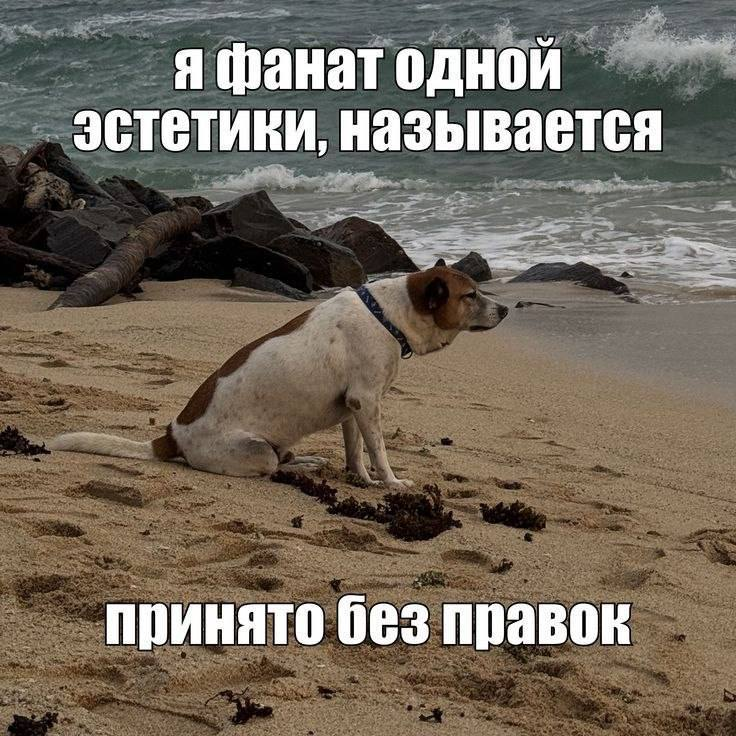

# Лабораторная работа №1

**ФИО**: Афанасенко Александр Иванович

**Группа**: 6403

**Научный руководитель**: Гошин Егор Вячеславович

> Сегодня один говорил со мной насчет того, чтобы ему
 стать жрецом Августа. Я говорю ему: «Человек, оставь это дело, потратишь  много впустую». - «Но пишущие слова, -
 говорит, - напишут мое имя». - <...> - «Напиши его на камне, и оно останется. Ну а за пределами Никополя какая о тебе останется память?» - «Но я буду носить золотой венок». - «Раз уж ты жаждешь венка, возьми венок из роз и надень - в нем ты будешь выглядеть наряднее».
>
> *Эпиктет*

